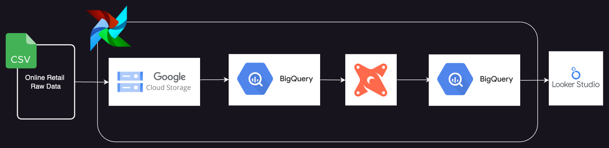
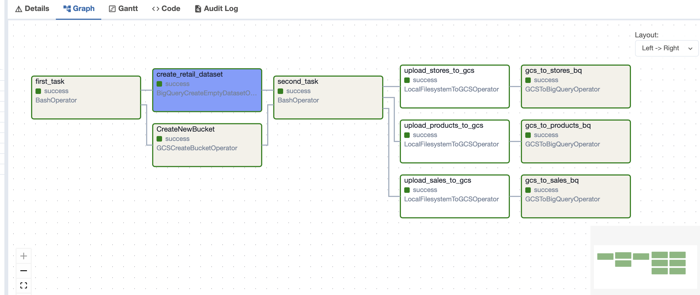
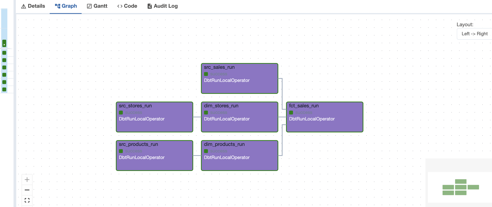
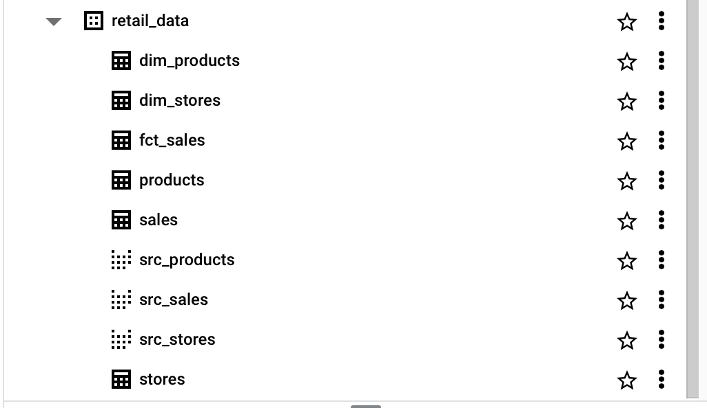
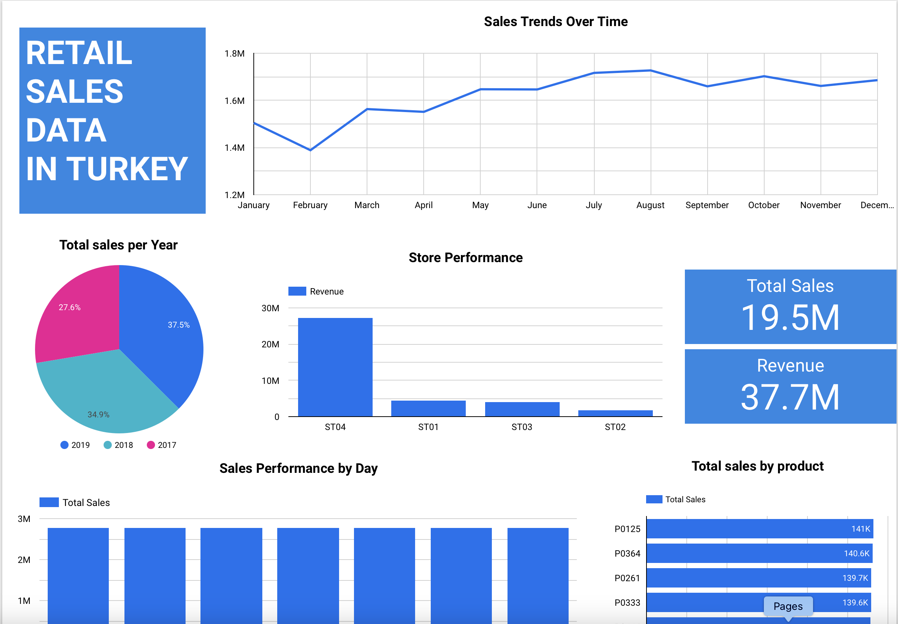

# An End-to-End Airflow Data Pipeline with BigQuery and dbt

## Table of Contents
- [Introduction](#introduction)
- [Architecture](#architecture)
- [Setup](#setup)
- [Astro CLI](#Astro CLI)
- [DBT Transformation](#dbt-transformation)
- [Dashboard Creation](#dashboard-creation)


## Introduction
**An End-to-End Airflow Data Pipeline with BigQuery and dbt** 
is a comprehensive data engineering project that automates 
the process of extracting data from a local device, uploading it to Google Cloud Storage, loading it into BigQuery, transforming the data using dbt to create dimension and fact tables, and finally visualizing the data through a dashboard.
## Architecture
1. **Data Extraction**: Data is extracted from the local device.
2. **Data Upload**: The extracted data is uploaded to Google Cloud Storage.
3. **Data Loading**: The uploaded data is then loaded into BigQuery.
4. **Data Transformation**: dbt is used to create dimension and fact tables in the BigQuery data warehouse.
5. **Data Visualization**: The transformed data is used to create a dashboard.



## Setup

### Prerequisites
- Python 3.x
- Google Cloud SDK
- Astro CLI
- dbt
- BigQuery
- Google Cloud Storage

### Environment Setup
1. **Install Google Cloud SDK**:
    Follow the instructions to install the [Google Cloud SDK](https://cloud.google.com/sdk/docs/install).


2. **Google Cloud Configuration**:
    - Set up Google Cloud SDK and authenticate.
    ```bash
    gcloud auth login
    gcloud config set project datapipeline-airflow-dbt
    ```
3. **Install Astro CLI**:
    Follow the instructions to install [Astro CLI](https://docs.astronomer.io/astro/cli/install-cli).

4. **Install dbt**:
    ```bash
    pip install dbt-bigquery
    ```

## Astro CLI Pipeline

### Objective
Automate the entire workflow using Astro CLI

### Astro CLI DAG

1. **Create Astro CLI Project**:
    - Initialize a new Astro project.
    ```bash
    astro dev init
    ```
2. **Define the DAG**:
   - Create a DAG file (e.g., `dags/retail.py`) to define the workflow steps for loading data.
     ```python 
      from datetime import timedelta, datetime
      from airflow import DAG, Dataset
      from airflow.operators.bash import BashOperator
      from airflow.providers.google.cloud.operators.gcs import GCSCreateBucketOperator
      from airflow.providers.google.cloud.transfers.local_to_gcs import LocalFilesystemToGCSOperator
      from airflow.providers.google.cloud.operators.bigquery import BigQueryCreateEmptyDatasetOperator
      from airflow.providers.google.cloud.transfers.gcs_to_bigquery import GCSToBigQueryOperator
      from airflow.utils.dates import days_ago
        

      first_task = BashOperator(
     task_id='first_task',
     bash_command='echo first task',
      )

      CreateNewBucket = GCSCreateBucketOperator(
            task_id="CreateNewBucket",
            bucket_name=BUCKET_NAME,
            project_id=PROJECT_ID,
            labels={"env": "dev", "team": "airflow"},
            storage_class="MULTI_REGIONAL",
            location="US",
            gcp_conn_id="airflow-dbt",
      )

       create_retail_dataset = BigQueryCreateEmptyDatasetOperator(
           task_id='create_retail_dataset',
           dataset_id=DATASET_NAME,
           gcp_conn_id='airflow-dbt',
       )
        
      .....
        
      # Define task dependencies
       first_task >> [CreateNewBucket, create_retail_dataset]
       [CreateNewBucket, create_retail_dataset] >> second_task
       second_task >> [upload_sales_to_gcs, upload_products_to_gcs, upload_stores_to_gcs]
      
       # Define dependencies for uploading to BigQuery
       upload_sales_to_gcs >> gcs_to_sales_bq
       upload_products_to_gcs >> gcs_to_products_bq
       upload_stores_to_gcs >> gcs_to_stores_bq
     
   - Create a DAG file (e.g., `dags/cosmos_dag.py`) to define the workflow steps for data transformation.
      ```python 
        from datetime import  datetime
        from cosmos import DbtDag, ProjectConfig, ProfileConfig, ExecutionConfig
        from cosmos.profiles import GoogleCloudServiceAccountFileProfileMapping 
   
        # Create the DbtDag
        my_cosmos_dag = DbtDag(
          project_config=project_config,
          profile_config=profile_config,
          execution_config=ExecutionConfig(dbt_executable_path=f"/usr/local/airflow/dbt_venv/bin/dbt",),
          # normal dag parameters
          operator_args={
              "install_deps": True,
          },
          schedule_interval="@daily",
          start_date=datetime(2023, 1, 1),
          catchup=False,
          dag_id="my_cosmos_dag",
          default_args={"retries": 2},
          tags=['dbt', 'bigquery']
        )
   
        # Define task dependencies
        my_cosmos_dag
      ```

3. **Run the DAG**:
    - Start the Astro CLI service and trigger the DAG.
    ```bash
    astro dev start
    ```

4. **Monitor the DAG**:
    - Use the Airflow web interface to monitor the DAG execution and ensure all tasks run successfully.

### Tasks Overview
The DAGs include the following types of tasks:
- Data Extraction 
- Creating a BigQuery dataset
- Creating a data storage bucket
- Data upload to GCS
- Data Loading to BigQuery
- Data transformation using dbt

### DAGs Execution Success
- retail dag 


- cosmos dag (dbt)


## DBT Transformation

### Objective
Transform and structure data within BigQuery using dbt to create a star schema data warehouse.

### Procedure

1. **Install dbt**:
    ```bash
    pip install dbt-bigquery
    ```

2. **Initialize dbt Project**:
    ```bash
    cd dags/dbt/
    dbt init dbtproject
    cd dbtproject
    ```

3. **Configure Profiles**:
    - Edit `profiles.yml` to include your BigQuery connection details.
   ```yaml
   dbtproject:
      outputs:
       dev:
         dataset: retail_data
         job_execution_timeout_seconds: 300
         job_retries: 1
         keyfile: /path/to/your-service-account-file.json
         location: US
         method: service-account
         priority: interactive
         project: datapipeline-airflow-dbt
         threads: 1
         type: bigquery
   target: dev
   ```
4. **Create Models**:
    - Organizing models into two folders: `staging` for reading data from BigQuery and `core` for transformations and creating dimension and fact tables.
    
   **Source Configuration**:
   
      - Define your source data in `models/source.yml`.
    ```yaml
    version: 2

    sources:
      - name: retail_data
        tables:
          - name: 'sales'
            description: Daily sales data covering 2017-2019.
          - name: 'products'
            description: Data containing the hierarchy and sizes of the products.
          - name: 'stores'
            description: Data containing the city, type and size information of the stores
    ```
   **Staging Model**:
    - Create a staging model to read data from the source.
    ```sql
    -- models/staging/src_sales.sql
    with raw_sales as (
    select
        *
    from
        {{ source('retail_data', 'sales')}}
   )
    select
        product_id,
        store_id,
        date as sales_date,
        EXTRACT(DAY FROM date ) AS day,
        EXTRACT(MONTH FROM date) AS month,
        EXTRACT(YEAR FROM date) AS year,
        FORMAT_TIMESTAMP('%A', date) AS day_name,
        sales,
        revenue,
        stock,
        price
    from
        raw_sales
    ```
    **Core Model**:
    - Create a core model to perform transformations and create dimension and fact tables.
    ```sql
    -- models/core/dim_products.sql
    with src_products as (
    select
        *
    from
       {{ ref('src_products') }}
    )
    select
        product_id,
        product_length,
        product_depth,
        product_width,
        cluster_id
    from
        src_products
    ```

5. **Run dbt**:
    ```bash
    dbt run
    ```



## Dashboard Creation

### Objective
Use Looker to create visual reports and dashboards based on the data warehouse.

### Dashboard

- **Dashboard Link**: [View Dashboard](https://lookerstudio.google.com/u/0/reporting/0628183e-1453-4452-b5bc-ddb63890b35d/page/KbO7D)

- **Screenshot**:
  


## Conclusion

This project successfully demonstrates how to build a data warehouse using dbt, load data into BigQuery, create transformations, generate reports using Looker, and automate the workflow with Astro CLI. The structured data warehouse provides a robust foundation for advanced analytics and business intelligence.


